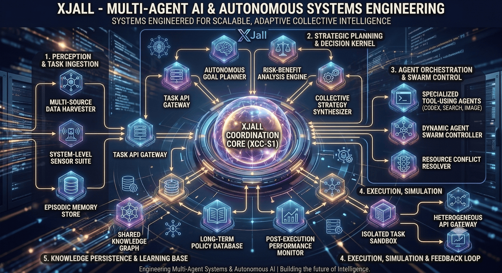

  

# Rizal (XJall)
**AI Systems Engineer | Autonomous Agents & Multi-Agent Architecture**

Membangun sistem kecerdasan buatan dari nol dengan fokus pada arsitektur perangkat lunak yang *scalable* dan *maintainable*. Saya lebih memprioritaskan pemahaman konsep mendalam, *clean code*, dan desain sistem yang solid dibandingkan sekadar mengimplementasikan solusi instan.

### 🏗️ Current Engineering Focus

Saat ini sedang mengembangkan ekosistem agen otonom dengan keterbatasan komputasi (dioptimasi untuk *mobile environment* / Termux), yang memaksa efisiensi kode dan ketepatan arsitektur:

*   **RizalAI** — Fondasi kecerdasan inti yang dirancang menggunakan *Clean Architecture*. Fokus pada implementasi memori episodik, kemampuan *reasoning* dinamis, dan penggunaan *tools* secara otonom.
*   **OtonomX** — *Engine* orkestrasi *multi-agent* berbasis *Event-Driven Architecture* dan *Registry Pattern* untuk mengoordinasikan *swarm agents* dalam menyelesaikan tugas kompleks.

### 💻 Stack & Paradigms

*   **Core Languages:** Python, JavaScript (Node.js)
*   **Architecture & Design:** Object-Oriented Programming (OOP), Clean Architecture, Modular Design, System Design
*   **Tools:** Linux, Git, Docker

### 📊 Engineering Metrics

  

  

  

