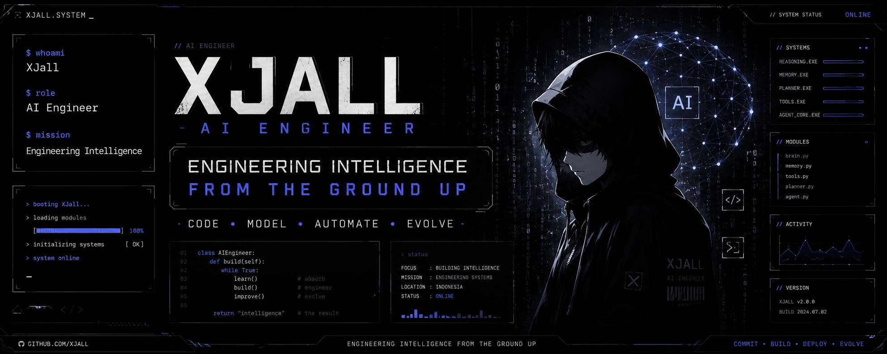

<p align="center">
  
</p>
<br>

<p align="center">
  
</p>

```bash
> whoami
XJall

> role
AI Engineer

> mission
Engineering intelligence from the ground up
```

---


```yaml
name: XJall
location: Indonesia
role: AI Engineer
specialization: Intelligent Systems
focus: Engineering Intelligence
```

---


```python
current_focus = [
    "Multi-Agent AI Systems",
    "Local LLM Assistants",
    "Autonomous Workflows",
    "AI Engineering"
]
```

---


```yaml
OtonomX:
  type: Multi-Agent Framework
  stack: Python
  status: active

AI_Experiments:
  type: Research Lab
  stack: AI / ML
  status: active
```

---


```python
def philosophy():
    foundation = "Strong Engineering"
    result = "Powerful Intelligence"
    return foundation + " -> " + result
```

---


<p align="center">
  
</p>

<p align="center">
  
</p>

---


<p align="center">
  
</p>

---


<p align="center">

</p>

```python
tech_stack = {
    "languages": ["Python", "JavaScript"],
    "ai_stack": ["Ollama", "LLM", "AI Agents"],
    "tools": ["Linux", "Git", "Docker"]
}
```

---

```python
while True:
    learn()
    build()
    improve()
```
