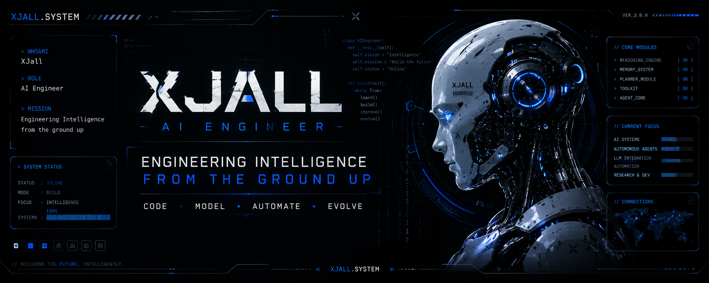

<p align="center">
  
</p>

```bash
> booting xjall.system...
status: online
```

---


```yaml
STATUS: ONLINE
MODE: BUILD
ROLE: AI ENGINEER
VERSION: XJALL V1
```

---


```yaml
name: XJall
location: Indonesia
role: AI Engineer
focus: [AI Systems, LLM, Agents, Automation]
```

---


```yaml
OtonomX:
  type: Multi-Agent Framework
  stack: Python
  status: ACTIVE

RizalAI:
  type: Intelligent AI Assistant
  stack: Python, Ollama
  status: ACTIVE

AI_Experiments:
  type: Research Lab
  stack: AI / ML
  status: ACTIVE
```

---


```python
class XJall:
    def mission(self):
        return "Engineering Intelligence
    def lifecycle(self):
        build()
        improve()
```

---


```python
modules = [
    "reasoning": "online",
    "memory": "online",
    "tools": "online",
    "agents": "online"
]
```

---


<p align="center">
  
</p>

---


<p align="center">
  
</p>

---


<p align="center">
  
</p>

```python
while True:
    learn()
    build()
    improve()
```
